<div align="center">


<br/>


</div>

---

## 📌 Table of Contents

- [Overview](#-overview)
- [Architecture](#️-high-level-architecture)
- [Tech Stack](#-tech-stack)
- [Machine Learning Pipeline](#-the-machine-learning-pipeline)
- [AI Intelligence Layer (SHAP + LLM Router)](#-the-ai-intelligence-layer--explainability-shap--llm)
- [MLOps & Continuous Learning](#-mlops--continuous-learning)
- [Folder Structure](#-clean-folder-structure)
- [🚀 Setup & Installation (Step by Step)](#-setup--installation-step-by-step)
  - [Prerequisites](#1️⃣-prerequisites)
  - [Extract / Clone the Project](#2️⃣-extract--clone-the-project)
  - [Backend Setup](#3️⃣-backend-setup-nodejs--express--mongodb)
  - [ML Service Setup](#4️⃣-ml-service-setup-python--fastapi)
  - [Frontend Setup](#5️⃣-frontend-setup-react--vite)
  - [Run Everything Together](#6️⃣-run-everything-together)
  - [Verify the Installation](#7️⃣-verify-the-installation)
- [API Reference](#-api-reference-quick-glance)
- [Troubleshooting](#-troubleshooting)
- [Contributing](#-contributing)
- [License](#-license)

---

## 🌱 Overview

**Seed2Success** is a production-ready **AI SaaS platform** that helps farmers **predict crop yields**, **monitor crop health**, and **optimize financial returns** — all from nothing more than **GPS coordinates**.

It bridges the gap between complex Machine Learning mathematics and actionable, localized farming advice by combining:

- 🌾 **Predictive AI** — RandomForest-based yield & crop prediction
- 🧠 **Generative AI** — Gemini/Groq-powered localized farmer-facing narratives
- 📊 **Explainability** — SHAP values so predictions are never a black box

---

## 🏗️ High-Level Architecture

The platform is decoupled into **three primary tiers**, communicating over secured internal APIs:

```mermaid
flowchart LR
    subgraph FE["🖥️ frontEnd — React + Vite + Tailwind"]
        A1[Planning Dashboard]
        A2[Health Dashboard]
        A3[Harvesting Dashboard]
        A4[Selling Dashboard]
        A5[AI Prediction Dashboard]
    end

    subgraph BE["🔐 BackEnd — Node.js + Express + MongoDB"]
        B1[JWT Auth]
        B2[Session History]
        B3[Secure Proxy<br/>X-API-Key]
        B4[/api/v1/feedback/]
    end

    subgraph ML["🧠 ml_service — Python + FastAPI (port 8000)"]
        C1[Open-Meteo API<br/>Temp · Rainfall · Humidity]
        C2[SoilGrids API<br/>pH · Nitrogen · SOC · Bulk Density]
        C3[RandomForestRegressor<br/>best_model.pkl]
        C4[SHAP TreeExplainer]
        C5[LLM Failover Router]
    end

    subgraph AI["✨ Generative Layer"]
        D1[Gemini — Primary]
        D2[Groq Llama-3 — Fallback]
        D3[Deterministic String Builder — Final Fallback]
    end

    FE -- HTTPS/JWT --> BE
    BE -- X-API-Key (internal) --> ML
    C1 --> C3
    C2 --> C3
    C3 --> C4
    C4 --> C5
    C5 --> D1
    D1 -.rate limit.-> D2
    D2 -.down.-> D3
    ML -- Prediction + Narrative --> BE
    BE -- JSON Response --> FE
```



> Decoupling the ML environment allows heavy data-science workloads (Pandas, Scikit-Learn) to scale independently from web traffic on AWS/GCP.

---

## 🧰 Tech Stack

| Layer | Technology | Purpose |
|---|---|---|
| **Frontend** | React, Vite, TailwindCSS | 5 dashboard modules, native CSS error banners, loading boundaries |
| **Backend** | Node.js, Express, MongoDB | Auth (JWT), session persistence, secure ML proxy |
| **ML Service** | Python, FastAPI, Scikit-Learn, Pandas, SHAP | Inference engine, explainability |
| **External Data** | Open-Meteo API, SoilGrids API | Real-time weather + soil data by GPS |
| **Generative AI** | Google Gemini, Groq (Llama-3) | Localized farmer-facing explanations |

---

## 🧠 The Machine Learning Pipeline

1. **The Model** — A `RandomForestRegressor` trained on historical agricultural data, saved at `ml_service/models/best_model.pkl`.
2. **Data Acquisition** — No manual soil input needed. Farmers just provide **Latitude/Longitude**:
   - 🌦️ **Open-Meteo API** → Temperature, Rainfall, Humidity
   - 🪨 **SoilGrids API** → Soil pH, Nitrogen, Soil Organic Carbon, Bulk Density
3. **The Output** —
   - ✅ Optimal crop recommendation
   - 📈 Estimated Yield (tons/hectare) with a confidence score
   - 🥈 Top 3 alternative crops

---

## 💡 The AI Intelligence Layer & Explainability (SHAP + LLM)

Seed2Success never dumps raw ML numbers on a farmer. Instead, it routes intelligence through layered explainability:

1. **SHAP Engine** — A `SHAP TreeExplainer` calculates *why* the model made its decision (e.g. *"High Nitrogen contributed positively, but Low Rainfall dragged the yield down"*).
2. **LLM Failover Router** — SHAP values + ML predictions are piped into a generative router:
   - 🥇 **Primary:** Google Gemini — localized, actionable narratives
   - 🥈 **Fallback:** Groq (Llama-3) — if Gemini hits rate limits
   - 🥉 **Final Fallback:** Deterministic string builder — if both APIs are down
3. **The Result** — A beautifully formatted, localized explanation of risks and recommended actions.

---

## 🔄 MLOps & Continuous Learning

Farmers can rate the accuracy of each prediction via a dedicated `/api/v1/feedback` route. This feedback is stored and lays the groundwork for:

- 📉 Data Drift Detection
- 🔁 Automated CI/CD model retraining as real-world climate conditions shift

---

## 📁 Clean Folder Structure

```
Seed2Success/
├── frontEnd/          # React / Vite app — 5 dashboard modules
│   ├── src/
│   ├── public/
│   └── package.json
│
├── BackEnd/           # Node.js Secure API Gateway
│   ├── src/
│   ├── routes/
│   ├── models/
│   └── package.json
│
├── ml_service/        # Python FastAPI Inference Engine
│   ├── app/
│   ├── models/
│   │   └── best_model.pkl
│   ├── data/
│   └── requirements.txt
│
└── docs/              # Markdown docs, EDA stats, business/audit reports
```

---

## 🚀 Setup & Installation (Step by Step)

<div align="center">

</div>

### 1️⃣ Prerequisites

Make sure the following are installed before you begin:

| Requirement | Recommended Version | Check Command |
|---|---|---|
| Node.js | v18+ | `node -v` |
| npm | v9+ | `npm -v` |
| Python | 3.10+ | `python3 --version` |
| pip | latest | `pip --version` |
| MongoDB | Local install or Atlas URI | `mongod --version` |
| Git | any recent | `git --version` |

---

### 2️⃣ Extract / Clone the Project

**If you have a `.zip` archive:**

```bash
unzip Seed2Success.zip -d Seed2Success
cd Seed2Success
```

**If you're cloning from a Git repository:**

```bash
git clone https://github.com/<your-org>/Seed2Success.git
cd Seed2Success
```

You should now see the 4-folder structure: `frontEnd/`, `BackEnd/`, `ml_service/`, `docs/`.

---

### 3️⃣ Backend Setup (Node.js + Express + MongoDB)

```bash
cd BackEnd
npm install
```

Create a `.env` file inside `BackEnd/`:

```env
PORT=5000
MONGO_URI=mongodb://localhost:27017/seed2success
JWT_SECRET=your_jwt_secret_here
ML_SERVICE_URL=http://localhost:8000
INTERNAL_API_KEY=your_shared_x_api_key_here
```

Start the backend gateway:

```bash
npm run dev
```

> The backend should now be running at **http://localhost:5000**.

---

### 4️⃣ ML Service Setup (Python + FastAPI)

```bash
cd ../ml_service
python3 -m venv venv
source venv/bin/activate      # On Windows: venv\Scripts\activate
pip install -r requirements.txt
```

Create a `.env` file inside `ml_service/`:

```env
GEMINI_API_KEY=your_gemini_api_key
GROQ_API_KEY=your_groq_api_key
INTERNAL_API_KEY=your_shared_x_api_key_here
```

> ⚠️ `INTERNAL_API_KEY` **must match** the value set in `BackEnd/.env` — this is the shared secret used for the secure `X-API-Key` proxy handshake.

Start the FastAPI inference engine:

```bash
uvicorn app.main:app --reload --port 8000
```

> The ML microservice should now be running at **http://localhost:8000** — visit `http://localhost:8000/docs` for the interactive Swagger UI.

---

### 5️⃣ Frontend Setup (React + Vite)

```bash
cd ../frontEnd
npm install
```

Create a `.env` file inside `frontEnd/`:

```env
VITE_API_BASE_URL=http://localhost:5000/api/v1
```

Start the dev server:

```bash
npm run dev
```

> The frontend should now be running at **http://localhost:5173** (default Vite port).

---

### 6️⃣ Run Everything Together

Open **three terminals** (or use a process manager like `concurrently` / `pm2`):

```bash
# Terminal 1 — ML Inference Engine
cd ml_service && source venv/bin/activate && uvicorn app.main:app --reload --port 8000

# Terminal 2 — Backend Gateway
cd BackEnd && npm run dev

# Terminal 3 — Frontend
cd frontEnd && npm run dev
```

**Request flow once all three are running:**

```
Browser (localhost:5173)
   ⇩ HTTPS + JWT
Backend Gateway (localhost:5000)
   ⇩ X-API-Key
ML Inference Engine (localhost:8000)
   ⇩ SHAP + LLM Router
Gemini → Groq → Deterministic Fallback
```

---

### 7️⃣ Verify the Installation

1. Visit `http://localhost:5173` — you should see the Seed2Success dashboard.
2. Register/login a test user (JWT flow via the backend).
3. Go to the **AI Prediction** module and submit a test GPS coordinate.
4. Confirm you receive: predicted crop, estimated yield, confidence score, top 3 alternatives, and a localized narrative explanation.
5. Check `http://localhost:8000/docs` to confirm the ML service is healthy and responding.

---

## 📡 API Reference (Quick Glance)

| Method | Endpoint | Description |
|---|---|---|
| `POST` | `/api/v1/auth/register` | Register a new farmer account |
| `POST` | `/api/v1/auth/login` | Authenticate and receive JWT |
| `POST` | `/api/v1/predict` | Submit GPS coords → get crop + yield prediction |
| `POST` | `/api/v1/feedback` | Submit accuracy rating for a prediction |
| `GET` | `/api/v1/history` | Retrieve a user's prediction history |

---

## 🛠️ Troubleshooting

| Issue | Likely Cause | Fix |
|---|---|---|
| Backend can't reach ML service | `ML_SERVICE_URL` wrong or ML service not running | Confirm `ml_service` is running on port 8000 |
| `401 Unauthorized` on ML proxy calls | `INTERNAL_API_KEY` mismatch | Ensure identical key in both `.env` files |
| MongoDB connection error | MongoDB not running / wrong URI | Start `mongod` locally or check Atlas connection string |
| Gemini/Groq calls failing silently | Missing or invalid API keys | Double-check `.env` in `ml_service/`; fallback chain will still respond via deterministic builder |
| Frontend shows CORS errors | Backend CORS not configured for Vite port | Whitelist `http://localhost:5173` in Express CORS config |

---

## 🤝 Contributing

Contributions are welcome! Please open an issue to discuss major changes before submitting a pull request.

```bash
git checkout -b feature/your-feature-name
git commit -m "Add: your feature description"
git push origin feature/your-feature-name
```

---

## 📄 License

Distributed under the **MIT License**. See `LICENSE` for details.

<div align="center">


**🌾 Seed2Success — Growing Smarter, Together 🌾**

</div>
